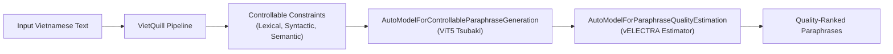

# VietQuill

<p align="center">
  
</p>

<p align="center">
  <strong>A Toolkit for Quality-Controlled Vietnamese Paraphrase Generation & Evaluation</strong>
</p>

<p align="center">
  <a href="https://pypi.org/project/vietquill/"></a>
  <a href="https://pypi.org/project/vietquill/"></a>
  <a href="https://github.com/ngwgsang/vietquill/blob/main/LICENSE"></a>
  <a href="https://huggingface.co/collections/ngwgsang/vietquill"></a>
</p>

---

## Overview

**VietQuill** is a unified framework designed for controllable Vietnamese paraphrase generation and quality estimation, supporting both research and production applications.

It centralizes datasets, generation methods, quality control techniques, and evaluation metrics into an intuitive and consistent Python interface. With VietQuill, researchers and developers can benchmark, fine-tune, and deploy paraphrase pipelines with minimal code.



## Key Highlights

- **Quality-Controlled Generation**: Fine-grained steering over **Lexical Diversity**, **Syntactic Divergence**, and **Semantic Preservation** (levels 0 to 100).
- **Style Presets**: Quick generation modes: `CONSERVATIVE`, `BALANCED`, and `DIVERSE`.
- **Automatic Domain Handling**: Automatic detection and optimal routing between statement and question inputs.
- **Comprehensive Quality Estimation**: Neural evaluation with `AutoModelForParaphraseQualityEstimation`, plus classic and neural metrics (`BERTScore`, `BLEU`, `TED`, `Jaccard`, `ParaScore`).
- **Standard Benchmark Datasets**: Built-in loaders for large-scale Vietnamese paraphrase benchmarks (ViQP, ViSP).

## Minimal Example

=== "Paraphrase Generation"
    ```python
    from vietquill import AutoModelForControllableParaphraseGeneration, ParaphraseStyle

    # Load model from Hugging Face Hub
    model = AutoModelForControllableParaphraseGeneration()

    # Generate with balanced style preset
    result = model.paraphrase(
        "Hôm nay thời tiết thật đẹp, mình muốn đi dạo ở công viên.",
        style=ParaphraseStyle.BALANCED,
        num_candidates=2
    )

    print(result)
    # Output: ['Thời tiết hôm nay rất đẹp, tôi muốn đi dạo công viên.', ...]
    ```

=== "Quality Estimation"
    ```python
    from vietquill import AutoModelForParaphraseQualityEstimation

    estimator = AutoModelForParaphraseQualityEstimation()
    scores = estimator.estimate(
        original="Hôm nay trời đẹp quá, mình muốn đi dạo công viên.",
        paraphrase="Thời tiết hôm nay thật tuyệt, tôi muốn tản bộ trong công viên."
    )

    print(scores)
    # Output: {'lexical_score': 24.48, 'syntactic_score': 78.26, 'semantic_score': 64.2}
    ```

## Navigation

- [Installation Guide](getting-started/installation.md) - How to install VietQuill and setup CUDA.
- [Quickstart](getting-started/quickstart.md) - Fast overview of core features.
- [Paraphrase Generation Guide](getting-started/generation.md) - Detailed usage of control parameters and batching.
- [Quality Evaluation Guide](getting-started/evaluation.md) - Estimators and automated metric scoring.
- [API Reference](api/generation.md) - Auto-generated documentation for modules and classes.
