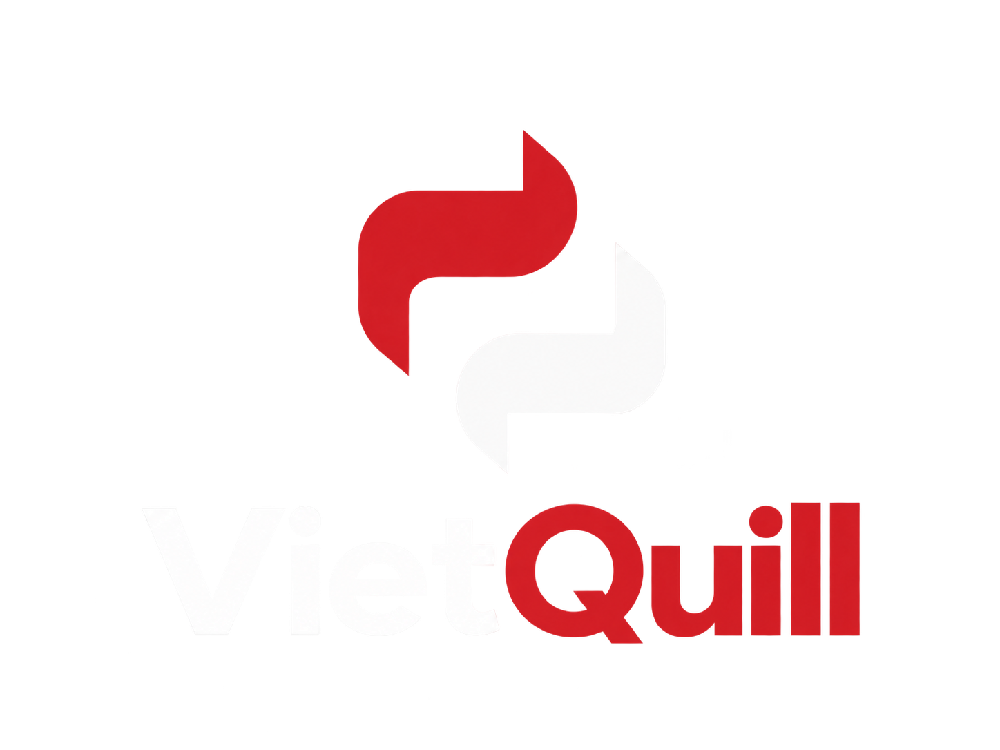

# VietQuill

<p align="center">
  
  
</p>

<p align="center">
  <strong>A Toolkit for Quality-Controlled Vietnamese Paraphrase Generation & Evaluation</strong>
</p>

<p align="center">
  <a href="https://pypi.org/project/vietquill/">
    
  </a>
  <a href="https://pypi.org/project/vietquill/">
    
  </a>
  <a href="https://github.com/ngwgsang/vietquill/blob/main/LICENSE">
    
  </a>
  
  
  <a href="https://huggingface.co/collections/ngwgsang/vietquill">
    
  </a>
  <a href="https://ieeexplore.ieee.org/document/11685721">
    
  </a>
</p>

---

### Overview

**VietQuill** is a Python toolkit for generating and evaluating Vietnamese paraphrases with controllable quality. It lets you easily rewrite sentences, tune diversity and grammar constraints, and evaluate paraphrase quality with minimal code.

### Example

=== "Paraphrase Generation"
    ```python
    from vietquill import AutoModelForControllableParaphraseGeneration, ParaphraseStyle

    # Load model from Hugging Face Hub
    model = AutoModelForControllableParaphraseGeneration()

    # Generate with balanced style preset
    result = model.paraphrase(
        "Hôm nay thời tiết thật đẹp, mình muốn đi dạo ở công viên.",
        style=ParaphraseStyle.BALANCED,
        num_candidates=2
    )

    print(result)
    # Output: ['Thời tiết hôm nay rất đẹp, tôi muốn đi dạo công viên.', ...]
    ```

=== "Quality Estimation"
    ```python
    from vietquill import AutoModelForParaphraseQualityEstimation

    estimator = AutoModelForParaphraseQualityEstimation()
    scores = estimator.estimate(
        original="Hôm nay trời đẹp quá, mình muốn đi dạo công viên.",
        paraphrase="Thời tiết hôm nay thật tuyệt, tôi muốn tản bộ trong công viên."
    )

    print(scores)
    # Output: {'lexical_score': 24.48, 'syntactic_score': 78.26, 'semantic_score': 64.2}
    ```

### Navigation

- [Installation](getting-started/installation.md) - How to install VietQuill and setup CUDA.
- [Quickstart](getting-started/quickstart.md) - Fast overview of core features.
- [Paraphrase Generation](getting-started/generation.md) - Detailed usage of control parameters and batching.
- [Paraphrase Evaluation](getting-started/evaluation.md) - Estimators and automated metric scoring.
- [Paraphrase Datasets](getting-started/datasets.md) - Standard benchmark datasets and schemas.
- [Fewshot Generation [LLM]](getting-started/fewshot_generation.md) - LLM-powered few-shot controllable paraphrase generation with custom control axes.
- [API Reference](api/generation.md) - Auto-generated documentation for modules and classes.
- [Sponsors](sponsors.md) - Project funding, grants, and sponsorship.

---

### Citation

VietQuill builds upon our previous research projects, ViQP and ViSP, extending them into a unified toolkit for Vietnamese paraphrase generation and quality estimation.

If VietQuill contributes to your research or software, please cite it using the following reference.

```bibtex
@inproceedings{nguyen2023viqp,
  title={Viqp: Dataset for vietnamese question paraphrasing},
  author={Nguyen, Sang Quang and Vo, Thuc Dinh and Nguyen, Duc PA and Tran, Dang T and Van Nguyen, Kiet},
  booktitle={2023 International Conference on Multimedia Analysis and Pattern Recognition (MAPR)},
  pages={1--6},
  year={2023},
  organization={IEEE}
}

@inproceedings{nguyen2025visp,
    title = "A Large-Scale Benchmark for {V}ietnamese Sentence Paraphrases",
    author = "Nguyen, Sang Quang  and
      Nguyen, Kiet Van",
    editor = "Chiruzzo, Luis  and
      Ritter, Alan  and
      Wang, Lu",
    booktitle = "Findings of the Association for Computational Linguistics: NAACL 2025",
    month = apr,
    year = "2025",
    address = "Albuquerque, New Mexico",
    publisher = "Association for Computational Linguistics",
    url = "https://aclanthology.org/2025.findings-naacl.59/",
    doi = "10.18653/v1/2025.findings-naacl.59",
    pages = "1045--1060",
    ISBN = "979-8-89176-195-7",
    abstract = "This paper presents ViSP, a high-quality Vietnamese dataset for sentence paraphrasing, consisting of 1.2M original{--}paraphrase pairs collected from various domains. The dataset was constructed using a hybrid approach that combines automatic paraphrase generation with manual evaluation to ensure high quality. We conducted experiments using methods such as back-translation, EDA, and baseline models like BART and T5, as well as large language models (LLMs), including GPT-4o, Gemini-1.5, Aya, Qwen-2.5, and Meta-Llama-3.1 variants. To the best of our knowledge, this is the first large-scale study on Vietnamese paraphrasing. We hope that our dataset and findings will serve as a valuable foundation for future research and applications in Vietnamese paraphrase tasks. The dataset is available for research purposes at \url{https://github.com/ngwgsang/ViSP}."
}

@inproceedings{nguyen2026vietquill,
  author={Nguyen, Sang Quang and Van Nguyen, Kiet},
  booktitle={2026 International Conference on Multimedia Analysis and Pattern Recognition (MAPR)}, 
  title={VietQuill: Quality-Controlled Paraphrase Generation for Vietnamese Language}, 
  year={2026},
  volume={},
  number={},
  pages={61-66},
  keywords={Modeling;Computational linguistics;Syntactics;Conferences;Manuals;Printing;Training;Estimation;Measurement;Equations;Paraphrase Generation;Controllable Generation;Quality-Aware Modeling;Vietnamese NLP;Low-Resource NLP},
  doi={10.1109/MAPR72750.2026.11685721}
}
```

---

### Acknowledgements & Funding

We sincerely thank the Vietnamese NLP community for their continuous support and valuable contributions. We also gratefully acknowledge the support of the University of Information Technology (UIT), Vietnam National University Ho Chi Minh City (VNU-HCM), which has made the development of VietQuill possible.

This research is funded by University of Information Technology - Vietnam National University Ho Chi Minh City under grant number **D4-2025-05**.
